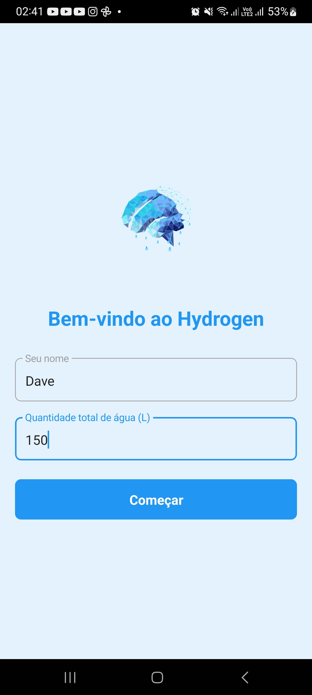
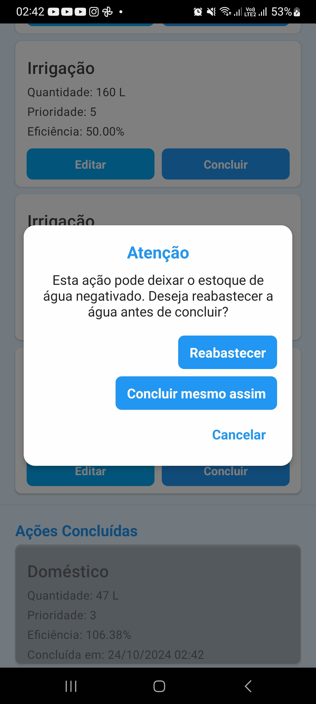
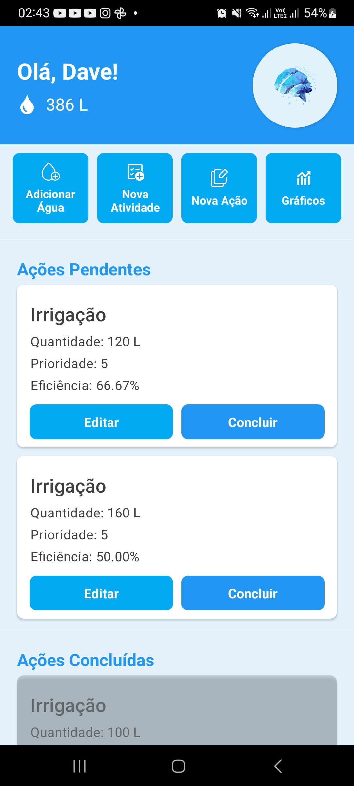
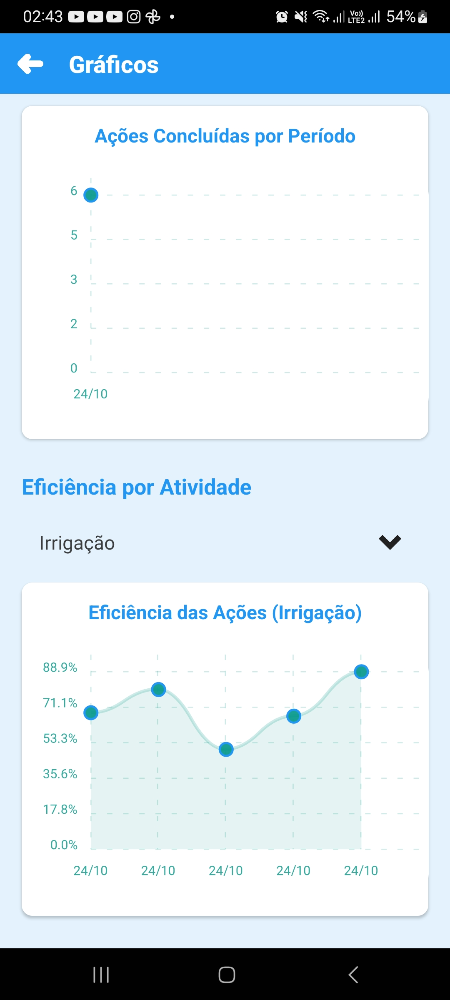

# Controle de Atividades App

Aplicativo React Native para controle de atividades e consumo de água.

## Pré-requisitos

- Node.js
- npm ou yarn
- React Native CLI
- Android Studio (para desenvolvimento Android)

## Dependências
npm install @react-navigation/native

npm install @react-navigation/stack

npm install react-native-paper

npm install react-native-sqlite-storage

npm install moment

npm install react-native-chart-kit

## Dependências de UI e navegação

npm install react-native-screens

npm install react-native-safe-area-context

npm install react-native-gesture-handler

npm install react-native-reanimated

npm install @react-native-masked-view/masked-view

npm install react-native-vector-icons

## Dependências para gráficos

npm install react-native-svg

## Instalação

1. Clone o repositório git clone [www.github.com/DaveSongnata/Hydrogen]

2. Instale as dependências
bash
npm install

4. Execute o projeto
npx react-native run-android

## Estrutura do Projeto

src/
├── assets/

│ └── icons/

├── components/

│ ├── common/

│ │ ├── CustomAlert.js

│ │ └── CustomIcon.js

│ ├── CriarAcao.js

│ ├── CriarAtividade.js

│ ├── EditarAcao.js

│ ├── Graficos.js

│ ├── Home.js

│ └── ReabastecerAgua.js

├── database/

│ └── db.js

└── styles/

└── theme.js

## Configuração Adicional

### Android

Adicione ao `android/app/build.gradle`:
gradle
android {
...
defaultConfig {
...
multiDexEnabled true
}
}

### Vector Icons

Adicione ao `android/app/build.gradle`: gradle
apply from: "../../node_modules/react-native-vector-icons/fonts.gradle"

## Screenshots

  

    
    
    
    
  

Dave, 2024.
